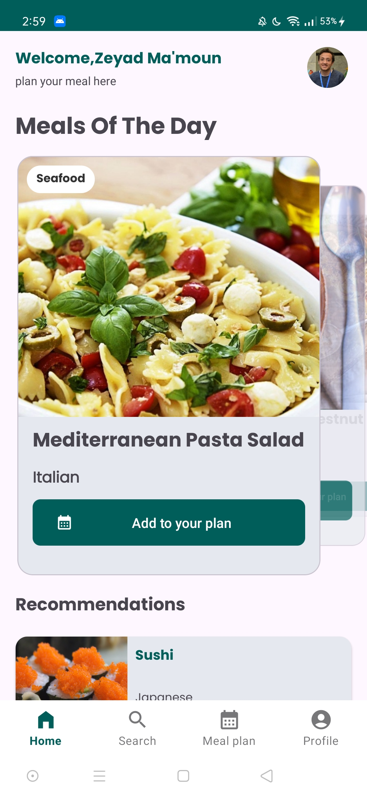
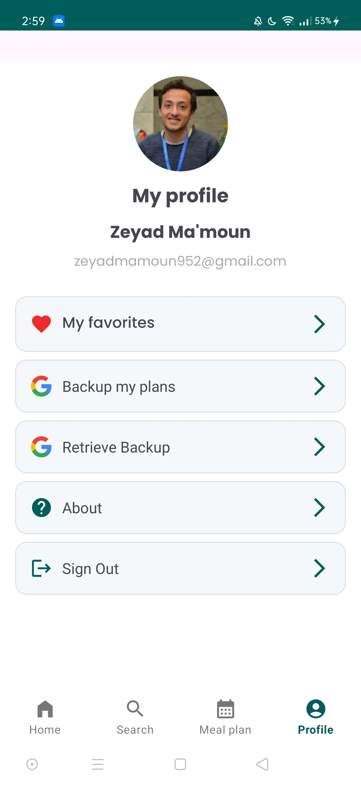
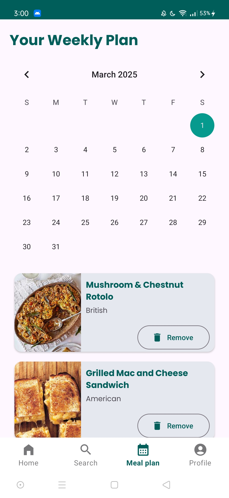

# Foodies App

### By: Zeyad Maamoun

## Description
Foodies App is an Android mobile application designed to help users plan their weekly meals efficiently. The app allows users to search for meals, view categories, and suggest meals based on various options. Users can also save their favorite meals to access them offline and synchronize their data for future access.

## Features
- **Meals of the Day:** Get daily inspiration with a random meals suggestion.
- **Search Meals:** Search for meals by country, ingredient, or category.
- **Categories List:** Browse meals by available categories.
- **Countries List:** View popular meals from different countries.
- **Favorites:** Add meals to your favorites list with offline access using Room database.
- **Meal Planning:** Plan weekly meals and add them to your schedule.
- **Data Synchronization:** Backup and restore meal plans and favorites using Firebase.
- **Authentication:** 
  - Simple Email & Password Authentication.
  - Social Media Authentication (Google).
  - Guest Mode with limited features.
- **Meal Details:** 
  - Meal Name
  - Image
  - Origin Country
  - Ingredients (with images if available)
  - Preparation Steps
  - Embedded Video Tutorial
  - Favorite Button
- **Splash Screen with Animation (Lottie)**
- **Offline Access:** View favorites and meal plans without network connectivity.

## Architecture
- **MVVM Architecture** for better separation of concerns.
- **Dependency Injection:** Koin
- **Reactive Programming:** RX-Java

## Technologies Used
- Java
- Room Database
- Firebase Authentication
- Retrofit
- Glide
- Lottie
- Material Design

## Installation
1. Clone the repository:
   ```bash
   git clone [https://github.com/Food-Planner/FoodiesApp.git](https://github.com/zeyadmamoun/Food-Planner.git)
   ```
2. Open the project in Android Studio.
3. Build and run the app on your emulator or physical device.

## Screenshots






## Contact
For any inquiries, feel free to contact:
**Zeyad Maamoun**
- Email: zeyadmamoun952@gmail.com
- LinkedIn: [www.linkedin.com/in/zeyadmaamoun](https://www.linkedin.com/in/zeyadmaamoun/)]

